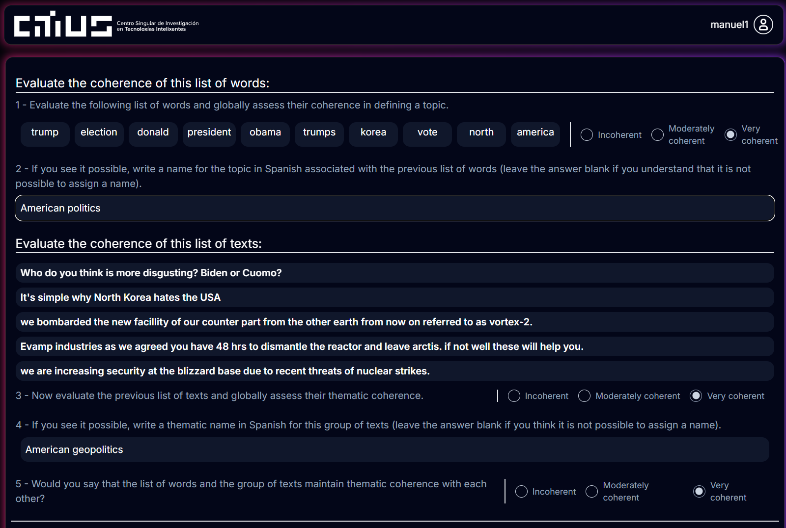

# Topic Annotation Tool

This web-based application was developed to facilitate the human evaluation of topic models, specifically designed for the study: **"Exploiting Topic Analysis Models to Explore Psychological Dimensions in Social Media Data"**. 

The tool serves as a bridge between automatic topic generation and qualitative human assessment, providing a rigorous framework for validating topic coherence in noisy datasets.



## 📋 Evaluation Workflow

The tool presents topics to reviewers in a randomized order to mitigate bias. For each topic, the annotator evaluates three primary dimensions based on a 3-point Likert scale (Incoherent, Moderately Coherent, Very Coherent):

1. **Top Words Question**: "Evaluate the following list of words and globally assess its coherence in defining a topic".
2. **Documents Question**: "Evaluate the following list of texts and globally assess their thematic coherence".
3. **Global Question**: "Would you say that the list of words and the group of texts are thematically coherent with each other?".

The tool also includes fields for "Topic-Name" and "Document-Name" where reviewers can provide a descriptive name for the identified theme.

---

## 🛠️ Database Preparation

The platform requires a MongoDB database to store the generated topics from the models and the subsequent human ratings.

### Prerequisites

1. **Topic Model Results**: Generate two CSV files from your topic modeling pipeline:
   - **Results file**: Document-level data with cluster assignments and probabilities
   - **Topics file**: Top words for each topic (one topic per column)

2. **MongoDB Instance**: A running MongoDB database with credentials

### Environment Configuration

The project requires **four separate `.env` files** in different locations:

#### 1. **Root `.env`** (project root directory)

Shared configuration accessible by all components:

```env
# Database Configuration
MONGO_HOST='mongodb://<user>:<password>@<host>:<port>/?authMechanism=DEFAULT'
ADMIN_HOST='mongodb://<user>:<password>@<host>:<port>/admin?authMechanism=DEFAULT'
DB_MONGO=<database_name>

# Topic Data Files
RESULTS_FILE=<file path>
TOPICS_FILE=<file path>

# Column Configuration
PROB_COLUMN=prob
CLUSTER_COLUMN=clusters
TOP_K_DOCS=5
```

#### 2. **Frontend Development** (`frontend/.env.development`)

Configuration for local development:

```env
NODE_ENV=development

# NextAuth Configuration
NEXTAUTH_URL=http://localhost:3000/api/auth
NEXTAUTH_SECRET=<random_development_secret>
```

#### 3. **Frontend Production** (`frontend/.env.production`)

Configuration for production deployment:

```env
NODE_ENV=production

# NextAuth Configuration
NEXTAUTH_URL=https://your-domain.com/api/auth
NEXTAUTH_SECRET=<strong_random_production_secret>
```

#### 4. **Backend** (`backend/.env`)

Configuration for backend scripts and data management:

```env
# Database Configuration
MONGO_HOST='mongodb://<user>:<password>@<host>:<port>/?authMechanism=DEFAULT'
ADMIN_HOST='mongodb://<user>:<password>@<host>:<port>/admin?authMechanism=DEFAULT'
DB_MONGO=<database_name>
```

> **Note**: You can copy database credentials from the root `.env` to avoid duplication, but each environment file must exist independently.

### Data Import Tool

Use the provided CLI tool to prepare and load topics into the database:

```bash
# Navigate to backend directory
cd backend

# View available commands
python scripts/manage_evaluations.py --help

# List existing users (annotators)
python scripts/manage_evaluations.py --list

# Prepare topics from configured files and assign to users interactively
python scripts/manage_evaluations.py --prepare --interactive --insert

# Or assign to specific users
python scripts/manage_evaluations.py --prepare --insert user1 user2 user3

# Reset evaluations for users (if needed)
python scripts/manage_evaluations.py --reset user1 user2

# Complete pipeline with description
python scripts/manage_evaluations.py --prepare \
    --reset user1 user2 \
    --insert user1 user2 \
    --description "Evaluation December 2024"
```

### CLI Tool Options

- `--list`: Display all registered users with their evaluation counts
- `--prepare`: Load topics from files specified in `backend/.env`
- `--interactive` / `-i`: Select users interactively from a menu
- `--reset [users]`: Remove existing evaluations for specified users
- `--insert [users]`: Assign prepared topics to users (randomized order)
- `--description` / `-d`: Add a custom description to the evaluation batch

### Expected File Formats

**Results File** (`RESULTS_FILE`):
```csv
text,prob,clusters
"document text here",0.95,0
"another document",0.87,1
...
```

**Topics File** (`TOPICS_FILE`):
```csv
0,1,2,3,...
word1,word1,word1,word1,...
word2,word2,word2,word2,...
...
```

### Reviewer Setup

Create user accounts for your annotators before running the data import. The study utilized 6 reviewers with backgrounds in Computer Science and Philology.

Each user will receive a randomized subset of topics to evaluate, ensuring unbiased assessments.

---

## 🚀 Installation and Execution

### Prerequisites

* **Node.js** (v16+) and **npm**
* **Python** (3.8+) for data preparation scripts
* **MongoDB** (v4.4+)

### Steps to Run

1. **Clone the repository**:
   ```bash
   git clone https://github.com/your-repo/topic-annotation-tool.git
   cd topic-annotation-tool
   ```

2. **Install dependencies**:
   ```bash
   # Frontend
   cd frontend
   npm install
   cd ..
   
   # Backend scripts
   cd backend
   conda env ceate -f requirements.txt
   cd ..
   ```

3. **Configure environment files**:
   ```bash
   # Create all required .env files
   touch .env
   touch frontend/.env.development
   touch frontend/.env.production
   touch backend/.env
   
   # Edit each file with your configuration (see Database Preparation section)
   ```

4. **Setup Database and Load Topics**:
   ```bash
   cd backend
   python scripts/manage_evaluations.py --prepare --interactive --insert
   cd ..
   ```

5. **Launch the application**:
   ```bash
   # Development
   cd frontend
   npm run dev
   
   # Production
   npm run build
   npm start
   ```

The tool will be accessible at:
- Development: `http://localhost:3000`
- Production: Your configured domain in `NEXTAUTH_URL`

---

## 📊 Data Analysis

Once the annotation phase is complete, the stored data can be exported to:

* Calculate **Fleiss' Kappa (κ)** to measure inter-annotator agreement.
* Compare human coherence scores against automatic metrics (NPMI, UMASS, CV, UCI).
* Perform qualitative analysis using the labels provided by the reviewers.

---

## 📁 Project Structure

```
topic-annotation-tool/
├── .env                          # Shared configuration
├── frontend/
│   ├── .env.development         # Development environment
│   ├── .env.production          # Production environment
│   └── ...
├── backend/
│   ├── .env                     # Backend configuration
│   └── scripts/
│       └── manage_evaluations.py
└── data/                         # Topic model outputs
```

---

## 📝 Reference

If you use this tool for your research, please cite:

*Couto Pintos, M., Losada, D. E., & Parapar, J. (2025). Exploiting Topic Analysis Models to Explore Psychological Dimensions in Social Media Data.*
 